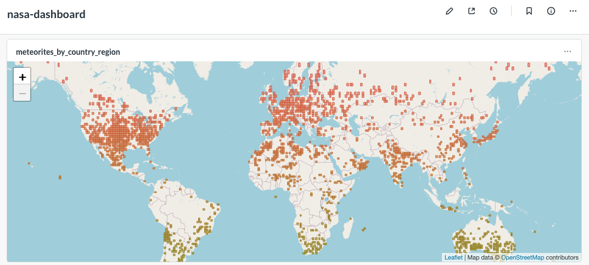
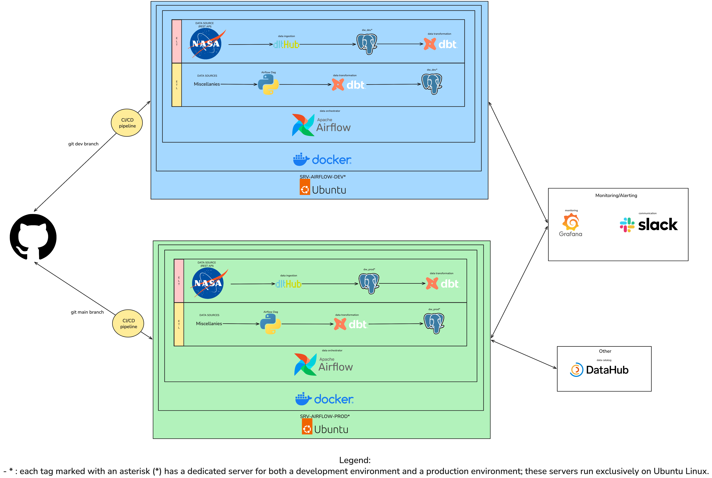
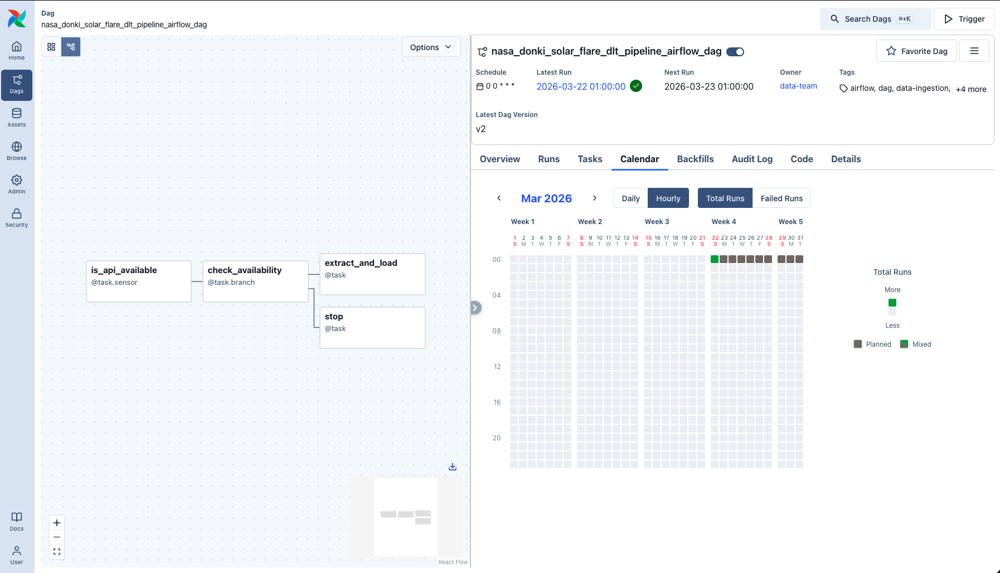
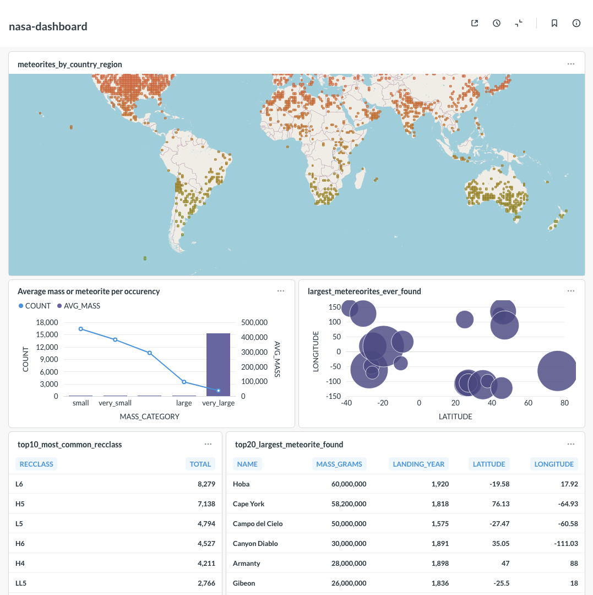
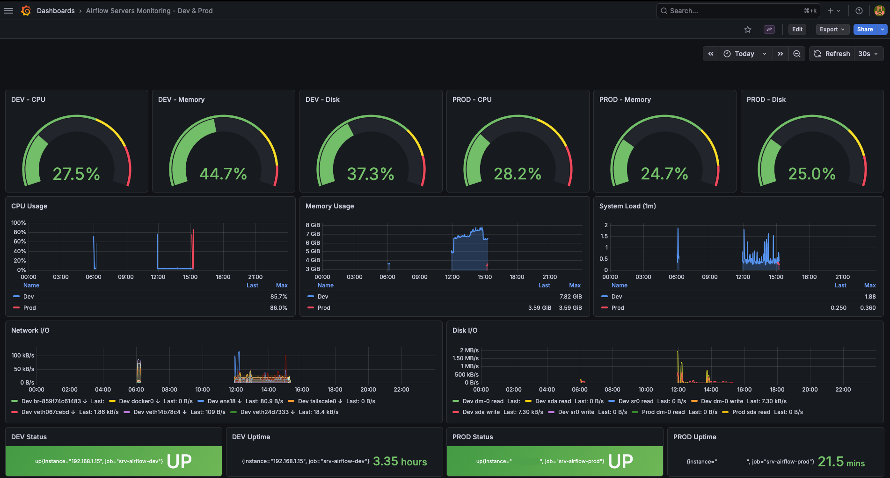

<h1 align="center"><b>NASA ANALYSIS</b></h1>

<div align="center">
  
</div>

<div align="center">

        

> **Un projet d'ingénierie des données de bout en bout qui collecte, transforme et visualise les données spatiales de la NASA — suivi des astéroïdes géocroiseurs, de l'activité des éruptions solaires et des impacts historiques de météorites.**
>
> **Déployé sur une infrastructure auto-hébergée fonctionnant sur Proxmox.**

🌐 [English](README.md) | **Français**

</div>

---

## 📋 Table des matières

1. [Pourquoi ce projet existe](#-pourquoi-ce-projet-existe)
2. [La Modern Data Stack](#-la-modern-data-stack)
3. [Architecture](#-architecture)
   - [Environnements](#-environnements)
   - [Infrastructure](#%EF%B8%8F-infrastructure)
   - [Flux du pipeline de données](#-flux-du-pipeline-de-données)
   - [Pattern ELT & Architecture Medallion](#%EF%B8%8F-pattern-elt--architecture-medallion)
   - [Pattern des DAGs](#-pattern-des-dags)
   - [Justification technique](#-justification-technique--pourquoi-chaque-décision-a-été-prise)
4. [ELT en pratique — Parcours de bout en bout](#-elt-en-pratique--parcours-de-bout-en-bout)
5. [Sources de données](#-sources-de-données)
6. [Stack technique](#-stack-technique)
7. [Structure du projet](#-structure-du-projet)
8. [dbt — Transformations](#%EF%B8%8F-dbt--transformations)
9. [Configuration Snowflake](#%EF%B8%8F-configuration-snowflake)
10. [Visualisation des données (Metabase)](#-visualisation-des-données-metabase)
11. [Monitoring & Alertes (Grafana)](#-monitoring--alertes-grafana)
12. [Pipeline CI/CD](#%EF%B8%8F-pipeline-cicd)
13. [Démarrage rapide](#-démarrage-rapide)
14. [Développement](#-développement)

---

## 🎯 Pourquoi ce projet existe

Ce projet a été construit comme un **portfolio personnel d'ingénierie des données** — une plateforme de données moderne de bout en bout, bâtie sur de véritables APIs publiques et jeux de données de la NASA, et non sur des exemples jouets ou des CSV pré-nettoyés. L'objectif était délibéré : concevoir, construire et opérer un **pipeline de qualité production** depuis zéro — avec une orchestration réelle, une évolution automatique des schémas, des contrats de qualité des données, du CI/CD et un modèle de transformation en couches — le tout fonctionnant sur une infrastructure auto-hébergée gérée par un seul ingénieur.

Chaque décision architecturale reflète la manière dont une équipe d'ingénierie des données aborderait ce problème dans une vraie entreprise. L'ensemble de la stack incarne la philosophie du **Minimalist's Data Stack** décrite dans [*The Minimalist's Data Stack*](https://perspectives.datainstitute.io/the-minimalists-data-stack-19b0a0aeef3e) du Data Institute : un seul ingénieur peut construire et maintenir une **plateforme de données complète et de qualité production** avec un petit ensemble d'outils composables et best-in-class — sans grande équipe ni budget cloud.

---

## 🛠 La Modern Data Stack

Ce projet s'appuie sur l'approche **Modern Data Stack (MDS)**, qui met l'accent sur des outils modulaires, best-in-class, orientés développeur et code-first.

* **🚀 Apache Airflow (Orchestration)**
  Le centre de commande de notre plateforme de données. Airflow permet d'écrire, planifier et surveiller des workflows en tant que code.
  > **Pourquoi nous l'utilisons :** Pour orchestrer la séquence d'ingestion, de validation et de transformation de manière fiable.

* **📥 dlt | dlthub (Ingestion)**
  Une bibliothèque Python pour le chargement de données. `dlt` (Data Load Tool) automatise le processus d'extraction et de chargement (EL), en gérant automatiquement les réponses API complexes et l'évolution des schémas.
  > **Pourquoi nous l'utilisons :** Pour simplifier le chargement de données JSON imbriquées depuis les APIs de la NASA dans Snowflake, sans maintenir manuellement les schémas.

* **🏛️ dbt (Transformation)**
  La couche de transformation (le « T » dans ELT). `dbt` (data build tool) permet de transformer les données dans l'entrepôt en utilisant SQL.
  > **Pourquoi nous l'utilisons :** Pour nettoyer, tester et modéliser les données brutes en tables prêtes pour l'analyse, grâce à des fichiers SQL modulaires et un contrôle de version intégré.

* **📊 Apache Metabase (Visualisation)**
  Un outil de business intelligence open-source qui se connecte directement aux tables Gold mart de Snowflake.
  > **Pourquoi nous l'utilisons :** Pour construire des tableaux de bord et graphiques interactifs à partir des modèles mart prêts pour l'analyse, sans écrire de code front-end.

---

## 📐 Architecture

<div align="center">
  
</div>

> **Ce que ce diagramme montre :** Le pipeline ELT complet — les sources de données NASA (APIs REST et CSV) sont extraites et chargées par `dlt` dans les schémas bruts de Snowflake, puis transformées à travers le modèle Medallion à trois couches de dbt (Bronze → Silver → Gold). Apache Airflow orchestre chaque étape de bout en bout.

[...]

| Couche | Préfixe | Dossier | Matérialisation | Responsabilité |
| :--- | :--- | :--- | :--- | :--- |
| **🟤 Bronze** | `base_*` | `models/staging/` | Vue | Snapshot brut 1:1 de la table source. Toutes les colonnes préservées, aucun filtrage, aucune logique métier. L'origine immuable référencée par tous les modèles Silver. |
| **⚪ Silver** | `stg__*` | `models/staging/` | Vue | Colonnes nettoyées, typées, renommées. Sélectionne les champs pertinents, caste les types, renomme en noms métier. Chaque modèle Silver référence son homologue Bronze via `ref()`. |
| **🟡 Gold** | `mart__*` | `models/marts/` | Table | Modèles prêts pour l'analyse, enrichis de colonnes dérivées, agrégations, parties de date et catégorisations métier. La couche finale disponible pour tout outil BI ou de reporting en aval. |

Placer Bronze et Silver dans le même dossier `staging/` est intentionnel : les deux se trouvent à l'extrémité orientée source du pipeline, mais les responsabilités sont clairement délimitées par le préfixe (`base_*` vs `stg__*`).

#### 🔁 Pattern des DAGs

Tous les DAGs partagent la même structure de tâches standard :

<div align="center">
  
</div>

[...]

| **Proxmox (auto-hébergé)** | Contrôle total de l'infrastructure à coût récurrent nul. Trois VMs reproduisent une topologie de production réelle (deux instances Airflow autonomes chacune avec leur propre PostgreSQL intégré, et une VM de monitoring dédiée). Gestion d'infrastructure pratique à une fraction du coût équivalent en VMs cloud. |
| **Grafana** | Plateforme de monitoring open-source fonctionnant exclusivement sur `srv-services`. Suit les métriques d'infrastructure au niveau serveur (CPU, mémoire, disque, réseau) pour toutes les VMs Proxmox et surveille la santé du traitement des DAGs Airflow. Les alertes sont routées vers Slack. Grafana n'a aucune connexion avec l'entrepôt de données Snowflake et ne joue aucun rôle dans le pipeline de données. |

#### ⚙️ CI/CD & Opérations
* **CI/CD :** Pipeline GitHub Actions avec trois étapes séquentielles — **Lint → Test → Ouvrir PR** — déclenché à chaque push ou pull request vers `main` et `dev`. Voir [`.github/workflows/ci-cd.yml`](.github/workflows/ci-cd.yml).
* **Monitoring & Observabilité :** Métriques serveur et infrastructure gérées par **Grafana** sur `srv-services`, avec alertes **Slack** intégrées. Grafana surveille les métriques au niveau hôte (CPU, mémoire, disque) et le traitement des DAGs — il n'est pas connecté à l'entrepôt de données.
* **Qualité du code :** **Ruff** applique le linting et le formatage Python sur l'ensemble du dépôt.

---

## 📊 Sources de données

| Source | API / Fichier | Description |
| :--- | :--- | :--- |
| **NeoWs** | API REST NASA NeoWs | Données d'approche rapprochée des astéroïdes géocroiseurs |
| **DONKI — GST** | API REST NASA DONKI | Enregistrements d'événements de tempêtes géomagnétiques |
| **DONKI — Éruptions solaires** | API REST NASA DONKI | Données d'activité et d'intensité des éruptions solaires |
| **Impacts de météorites** | CSV (NASA Open Data) | Enregistrements historiques d'impacts de météorites |

---

## 💻 Stack technique

| Couche | Outil | Version / Spec |
| :--- | :--- | :--- |
| **Orchestration** | Apache Airflow (CeleryExecutor) | `3.1.8` |
| **Ingestion** | dltHub | `1.23` |
| **Entrepôt de données** | Snowflake | — |
| **Transformations** | dbt Fusion | `1.0.0.40.15` |
| **Broker de messages** | Redis | `7.2` |
| **Qualité du code** | Ruff | `0.15.7` |
| **Visualisation** | Apache Metabase | — |
| **Monitoring d'infrastructure** | Grafana | `12.4.1` |
| **CI/CD** | GitHub Actions | — |
| **Langage** | Python | `≥ 3.13` |

---

## 📁 Structure du projet

```text
nasa-analysis/                     # Répertoire racine du projet d'analyse NASA
.
├── .github                        # Configuration GitHub
│   ├── instructions               # Instructions Copilot
│   └── workflows
│       └── ci-cd.yml              # Pipeline CI/CD GitHub Actions
├── .dlt                           # Répertoire de configuration DLT (Data Load Tool)         [gitignored]
│   ├── config.toml                # Fichier de configuration DLT (paramètres du pipeline)     [gitignored]
│   └── secrets.toml               # Fichier de secrets DLT (identifiants, clés API)           [gitignored]
├── .env.example                   # Exemple de fichier de variables d'environnement
├── .gitignore                     # Fichiers/dossiers à ignorer dans Git
├── .python-version                # Spécification de la version Python (pour pyenv)
├── README.md                      # Documentation du projet (anglais)
├── README.fr.md                   # Documentation du projet (français)
├── config                         # Répertoire de configuration Airflow
│   ├── airflow.cfg                # Fichier de configuration principal Airflow
│   └── airflow_local_settings.py  # Paramètres Airflow personnalisés
├── dags                           # Répertoire des DAGs Airflow
│   ├── dlt_pipelines              # Sous-répertoire pour les définitions de pipelines DLT
│   │   ├── nasa_donki_gst_pipeline.py                # Pipeline Tempêtes Géomagnétiques DONKI
│   │   ├── nasa_donki_solar_flare_pipeline.py        # Pipeline Éruptions Solaires DONKI
│   │   ├── nasa_meteorite_landings_dataset_pipeline.py # Pipeline Impacts de Météorites

[...]

│   │   │   ├── stg__nasa_donki_solar_flare.sql                        # ⚪ Silver
│   │   │   ├── stg__nasa_meteorite_landings.sql                       # ⚪ Silver
│   │   │   └── stg__nasa_neows.sql                                    # ⚪ Silver
│   │   └── marts                  # Couche Gold (tables)
│   │       ├── mart__nasa_donki_gst.sql                               # 🟡 Domaine
│   │       ├── mart__nasa_donki_solar_flare.sql                       # 🟡 Domaine
│   │       ├── mart__nasa_meteorite_landings.sql                      # 🟡 Domaine
│   │       ├── mart__nasa_neows.sql                                   # 🟡 Domaine
│   │       ├── mart__nasa_meteorite_by_decade.sql                     # 🟡 Viz
│   │       ├── mart__nasa_neows_hazard_summary.sql                    # 🟡 Viz
│   │       ├── mart__nasa_solar_flare_class_summary.sql               # 🟡 Viz
│   │       └── mart__nasa_space_weather_monthly.sql                   # 🟡 Viz
│   └── dbt_packages               # Packages dbt installés                               [gitignored]
├── docker-compose.yaml            # Configuration Docker Compose pour les services
├── img                            # Répertoire des ressources images
│   ├── airflow_dag_example.png            # Capture d'écran d'un DAG Airflow
│   ├── nasa_data_engineering_project.png  # Diagramme d'architecture du projet
│   └── nasa_project_infrastructure.png    # Diagramme d'infrastructure
├── pyproject.toml                 # Configuration du projet Python (système de build, outils)
├── logs                           # Fichiers de logs
├── requirements.txt               # Dépendances Python
├── tests                          # Tests unitaires (pytest)
│   ├── test_donki_gst_pipeline.py
│   ├── test_donki_solar_flare_pipeline.py
│   ├── test_meteorite_pipeline.py
│   └── test_neows_pipeline.py
├── utils                          # Répertoire des scripts utilitaires
│   ├── build.sh                   # Script d'automatisation du build
│   └── linting.sh                 # Script de linting du code
└── uv.lock                        # Fichier de verrouillage pour le gestionnaire de paquets UV
```

---

## 🏛️ dbt — Transformations

Le projet `dbt_nasa/` utilise **dbt Fusion** et suit une structure de modèle à deux couches.

### Couches de modèles

| Couche | Préfixe | Dossier | Matérialisation | Rôle |
| :--- | :--- | :--- | :--- | :--- |
| **🟤 Bronze** | `base_*` | `models/staging/` | Vue | Snapshot brut 1:1 de la source. Toutes les colonnes, aucune logique. |
| **⚪ Silver** | `stg__*` | `models/staging/` | Vue | Nettoyé, typé, renommé. Référence Bronze via `ref()`. |
| **🟡 Gold** | `mart__*` | `models/marts/` | Table | Modèles enrichis prêts pour l'analyse. La couche finale pour la consommation en aval. |

#### Marts de domaine principaux

| Modèle | Description |
| :--- | :--- |
| `mart__nasa_neows` | Astéroïdes géocroiseurs avec diamètre, magnitude et attributs de dangerosité |
| `mart__nasa_donki_gst` | Événements de tempêtes géomagnétiques enrichis avec `event_year`, `event_month`, `event_day_of_week` |
| `mart__nasa_donki_solar_flare` | Événements d'éruptions solaires avec `class_category` NOAA dérivée et colonnes de date |
| `mart__nasa_meteorite_landings` | Impacts de météorites avec coordonnées typées, `landing_year` et `mass_category` catégorisée |

#### Marts de visualisation

Construits sur les marts de domaine pour alimenter la consommation en aval des données agrégées de météorologie spatiale et d'astronomie :

| Modèle | Cas d'usage du tableau de bord |
| :--- | :--- |
| `mart__nasa_neows_hazard_summary` | Nombre d'astéroïdes et statistiques de diamètre répartis par indicateur de dangerosité — panneaux de stat et camemberts |
| `mart__nasa_solar_flare_class_summary` | Nombre d'éruptions mensuelles par classe NOAA — graphique d'intensité en série temporelle |
| `mart__nasa_space_weather_monthly` | Nombre de GST et d'éruptions combinés par mois — tableau de bord de tendances multi-jeux de données |
| `mart__nasa_meteorite_by_decade` | Nombre d'impacts et masse agrégés par décennie — graphique de chronologie historique |

### Commandes principales

```bash
cd dbt_nasa

# Installer / mettre à jour les dépendances
dbt deps

# Exécuter tous les modèles
dbt run

# Exécuter un seul modèle
dbt run --select stg__nasa_neows

# Exécuter une couche entière
dbt run --select staging
dbt run --select marts

# Exécuter les tests de qualité des données
dbt test

# Tester un seul modèle
dbt test --select mart__nasa_donki_gst

# Build (run + test) — recommandé pour le CI
dbt build

# Build uniquement les modèles modifiés depuis le dernier run
dbt build --select state:modified+

# Prévisualiser le SQL compilé sans l'exécuter
dbt compile

# Générer et servir la documentation
dbt docs generate
dbt docs serve          # ouvre http://localhost:8080

# Nettoyer les artefacts compilés
dbt clean
```

### Configuration

[...]

### Étape 2 — `is_api_available` (HttpSensor)

Le sensor interroge l'endpoint NASA DONKI `/FLR` avec la plage de dates configurée et la clé API. Il réessaie toutes les 30 secondes :
- **HTTP 200** avec données → retourne la réponse brute, passe à `check_availability`
- **HTTP 429** (rate-limited) → retourne `None`, passe à `check_availability`
- **Tout autre échec** → continue de sonder (Airflow gère les nouvelles tentatives)

### Étape 3 — `check_availability` (BranchPythonOperator)

Inspecte la sortie du sensor :
- Données retournées → route vers `extract_and_load`
- `None` (rate-limited ou vide) → route vers `stop` (ignoré proprement, aucune alerte)

### Étape 4 — `extract_and_load` (dlt)

`dlt` appelle l'API DONKI `/FLR` et reçoit un tableau JSON d'objets d'éruptions solaires :

```json
[
  {
    "flrID": "2024-03-15T01:00:00-FLR-001",
    "beginTime": "2024-03-15T01:00Z",
    "peakTime": "2024-03-15T01:23Z",
    "endTime": "2024-03-15T01:45Z",
    "classType": "M1.5",
    "sourceLocation": "N12W34",
    "activeRegionNum": 13590
  }
]
```

`dlt` automatiquement :
- **Infère le schéma** à partir des clés JSON
- **Normalise** la structure imbriquée en colonnes plates (snake_case : `flrID` → `flr_id`)
- **Fusionne** avec la table existante en utilisant `flrID` comme clé primaire — aucun doublon lors des ré-exécutions
- **Charge** dans Snowflake : `dw_nasa_dev.nasa_donki_solar_flare.nasa_donki_response`

Si la NASA ajoute un nouveau champ à la réponse API, `dlt` détecte le changement de schéma et ajoute automatiquement la colonne lors de la prochaine exécution — aucune migration manuelle requise.

[...]

### Étape 9 — Tableau de bord Metabase

Metabase se connecte directement à Snowflake et interroge `mart__nasa_solar_flare_class_summary`. Un graphique à barres en série temporelle groupé par `class_category` et ordonné par `event_year + event_month` est rendu sans SQL requis — l'agrégation est déjà effectuée dans la couche Gold.

**Lignage complet pour ce pipeline :**
```
API NASA DONKI
  → dlt (Extraction + Chargement)
    → nasa_donki_solar_flare.nasa_donki_response          [table brute]
      → base_nasa_donki_solar_flare_nasa_donki_response   [🟤 Vue Bronze]
        → stg__nasa_donki_solar_flare                     [⚪ Vue Silver]
          → mart__nasa_donki_solar_flare                  [🟡 Table Gold]
            → mart__nasa_solar_flare_class_summary        [🟡 Table Viz]
              → Tableau de bord Metabase
```

---

## � Visualisation des données (Metabase)

<div align="center">
  
</div>

> **Ce que ce tableau de bord montre :** Le `nasa-dashboard` dans Metabase, connecté directement aux tables Gold mart de Snowflake. Cinq panneaux visualisent le jeu de données des impacts de météorites : une carte du monde de chaque site d’impact répertorié coloré selon la densité régionale, un graphique combiné du nombre de météorites vs la masse moyenne décomposé par catégorie de masse, un scatter plot à bulles des météorites les plus massives placées selon leurs coordonnées géographiques (taille de la bulle = masse), un tableau classé des 10 types de reclassification les plus fréquents, et un tableau de référence des 20 météorites les plus lourdes jamàis retrouvées avec leur masse, année d’impact et coordonnées.

Apache Metabase se connecte directement aux **tables Gold mart** (`mart__*`) dans le schéma Snowflake `dbt_nasa` — il n’interroge jamais les couches brutes ou de staging. Aucun SQL n’est requis dans la couche BI : toutes les agrégations et colonnes dérivées sont déjà calculées en amont par `dbt`, chaque panneau est donc construit via l’interface point-and-click de Metabase.

### Panneaux du tableau de bord

| Panneau | Modèle source | Description |
| :--- | :--- | :--- |
| **meteorites_by_country_region** | `mart__nasa_meteorite_landings` | Carte du monde représentant chaque impact de météorite par latitude/longitude, coloré selon la densité régionale |
| **Average mass per occurrence** | `mart__nasa_meteorite_landings` | Graphique combiné : nombre de météorites (courbe) et masse moyenne en grammes (barre) décomposé par `mass_category` (small → very_large) |
| **largest_meteorites_ever_found** | `mart__nasa_meteorite_landings` | Scatter plot à bulles des météorites les plus massives selon leurs coordonnées géographiques — la taille de la bulle représente la masse |
| **top10_most_common_recclass** | `mart__nasa_meteorite_landings` | Tableau classé des 10 types de reclassification les plus fréquents (ex. L6 : 8 279 · H5 : 7 138) |
| **top20_largest_meteorite_found** | `mart__nasa_meteorite_landings` | Tableau de référence des 20 météorites les plus lourdes avec nom, masse en grammes, année d’impact, latitude et longitude |

---

## �📈 Monitoring & Alertes (Grafana)

<div align="center">
  
</div>

Le monitoring serveur et infrastructure est géré par **Grafana `12.4.1`** fonctionnant exclusivement sur `srv-services`. Il **n'a aucun rôle dans le pipeline de données** et **aucune connexion à Snowflake** — son seul objectif est de suivre la santé de l'infrastructure et d'alerter en cas de problème.

### Ce qui est surveillé

| Catégorie | Métriques | Source |
| :--- | :--- | :--- |
| **CPU** | Utilisation %, charge moyenne par cœur | Node Exporter (3 VMs) |
| **Mémoire** | RAM utilisée/disponible, swap | Node Exporter (3 VMs) |
| **Disque** | I/O lecture/écriture, espace utilisé/libre | Node Exporter (3 VMs) |
| **Réseau** | Octets entrants/sortants, paquets perdus | Node Exporter (3 VMs) |
| **Traitement des DAGs** | Erreurs d'import de DAG, durée du parser | Métriques Airflow StatsD |

### Routage des alertes

Les alertes sont configurées dans Grafana et routées directement vers **Slack** via un webhook. Les notifications sont déclenchées lors de :
- CPU d'une VM soutenu au-dessus du seuil
- Pression mémoire approchant la capacité
- Espace disque en dessous du seuil de sécurité
- Erreurs d'import de DAG détectées dans le processor Airflow

### Architecture

Les trois VMs exposent leurs métriques système via **Prometheus Node Exporter**. Grafana sur `srv-services` collecte ces endpoints et les rend dans un tableau de bord unifié. Il s'agit d'un modèle pull unidirectionnel — `srv-services` contacte les autres VMs ; elles ne lui envoient pas de données.

```
srv-airflow-dev  ──[Node Exporter:9100]──┐
srv-airflow-prod ──[Node Exporter:9100]──┤──► Prometheus ──► Grafana (srv-services)
srv-services     ──[Node Exporter:9100]──┘                        │
                                                               Alertes Slack
```

### Séparation de la Data Stack

Grafana opère intentionnellement dans une voie séparée du pipeline ELT :

| Ce que Grafana fait | Ce que Grafana ne fait PAS |
| :--- | :--- |
| Surveiller CPU / mémoire / disque / réseau des VMs | Interroger Snowflake ou les modèles dbt |
| Alerter sur les erreurs de traitement des DAGs | Visualiser les métriques des données NASA |
| Suivre la santé du scheduler Airflow | Se connecter à un entrepôt de données |

La visualisation des données (graphiques, tableaux de bord sur les données scientifiques NASA) est gérée par **Apache Metabase**, qui se connecte directement aux tables Gold mart dans Snowflake. Grafana et Metabase sont des outils entièrement séparés avec des responsabilités non chevauchantes.

---

## ⚙️ Pipeline CI/CD

Le projet utilise **GitHub Actions** ([`.github/workflows/ci-cd.yml`](.github/workflows/ci-cd.yml)) avec trois jobs séquentiels déclenchés à chaque push ou pull request vers `main` et `dev` :

| Étape | Job | Ce qu'il fait |
| :---: | :--- | :--- |
| 1 | **Lint** | Exécute `ruff check` et `ruff format --check` sur le répertoire `dags/`. Échoue rapidement en cas d'erreur de style ou de lint. |
| 2 | **Test** | Exécute `pytest tests/ -v`. Ne s'exécute que si le lint passe. |
| 3 | **Ouvrir PR** | Crée automatiquement une pull request de `dev` → `main`. Ne s'exécute que sur les pushs directs vers `dev` (pas les PRs). Utilise le `GITHUB_TOKEN` intégré — aucun secret personnalisé requis. |

---

## 🚦 Démarrage rapide

### 1. Prérequis
* **Docker** et **Docker Compose**
* **Git**
* Une [clé API NASA](https://api.nasa.gov/) *(gratuite)*

### 2. Configuration de l'environnement
Le projet utilise des fichiers d'environnement basés sur la branche :
* La branche `dev` utilise `.env.dev`
* La branche `main` utilise `.env.prod`

Créez le fichier env approprié en copiant l'exemple et en renseignant les valeurs requises :
```bash
cp .env.example .env.dev
```

<details>
<summary><b>Cliquer ici pour voir les variables d'environnement requises</b></summary>
<br>

```dotenv
# Authentification Airflow
AIRFLOW__API_AUTH__JWT_SECRET=
AIRFLOW__API_AUTH__JWT_ISSUER=

# Base de données Airflow
AIRFLOW__DATABASE__SQL_ALCHEMY_CONN=
AIRFLOW__CELERY__RESULT_BACKEND=

# PostgreSQL
POSTGRES_USER=
POSTGRES_PASSWORD=
POSTGRES_DB=

# Utilisateur admin Airflow
_AIRFLOW_WWW_USER_USERNAME=
_AIRFLOW_WWW_USER_PASSWORD=

# API NASA
AIRFLOW_VAR_NASA_API_KEY=

# Optionnel
LOAD_EXAMPLES=false
AIRFLOW_UID=   # exécuter : echo $(id -u)
```
</details>

### 3. Lancement de la plateforme

Clonez le dépôt et sélectionnez votre branche :
```bash
git clone <repo-url>
cd nasa-analysis
git checkout dev  # ou 'main'
```

Démarrez tous les services en utilisant le script de build :
```bash
bash utils/build.sh
bash utils/build.sh --volumes  # supprime tous les volumes et en crée de nouveaux
bash utils/build.sh --networks # supprime tous les réseaux et en crée de nouveaux
bash utils/build.sh --volumes --networks # supprime tous les volumes et réseaux et en crée de nouveaux
```
*(Le script sélectionne automatiquement le bon fichier env, arrête toute stack en cours d'exécution et démarre les services.)*

**Accéder à l'interface Airflow :** [http://localhost:8080](http://localhost:8080)

---

## 🔧 Développement

**Exécuter le linter et le formateur :**
```bash
ruff check .
ruff format .
```

**Exécuter les tests unitaires :**
```bash
uv run pytest tests/ -v
```

**Déclencher les transformations dbt manuellement :**
```bash
cd dbt_nasa

dbt deps                  # installer les packages dbt (dbt_utils, etc.)
dbt run                   # construire tous les modèles (vues staging + tables mart)
dbt test                  # exécuter tous les tests de qualité des données
dbt build                 # run + test en une seule commande (recommandé)
```

---

## ❄️ Configuration Snowflake

Toutes les données arrivent dans une seule base de données Snowflake (`dw_nasa_dev`). `dlt` gère les schémas d'ingestion bruts ; `dbt` gère le schéma de transformation.

### Organisation des schémas

```
dw_nasa_dev
├── nasa_donki_gst            ← schéma brut dlt (événements GST)
│   └── nasa_donki_gst_response
├── nasa_donki_solar_flare    ← schéma brut dlt (éruptions solaires)
│   └── nasa_donki_response
├── nasa_meteorite_landings   ← schéma brut dlt (impacts de météorites)
│   └── meteorite_landings
├── nasa_neows                ← schéma brut dlt (objets géocroiseurs)
│   └── nasa_neows_response
└── dbt_nasa                  ← schéma de transformation dbt
    ├── base_*                   (Vues Bronze)
    ├── stg__*                   (Vues Silver)
    └── mart__*                  (Tables Gold)
```

### Identifiants & Rôles

[...]

### Profil de connexion dbt

Configurez `dbt_nasa/profiles.yml` (ou `~/.dbt/profiles.yml`) avec les identifiants `loader` :

```yaml
dbt_nasa:
  target: dev
  outputs:
    dev:
      type: snowflake
      account: "<account_identifier>"   # ex. xy12345.eu-west-1
      user: loader
      password: "<votre_mot_de_passe>"
      role: DLT_LOADER_ROLE
      database: dw_nasa_dev
      warehouse: COMPUTE_WH
      schema: dbt_nasa
      threads: 4
```

### Secrets dlt

Configurez `.dlt/secrets.toml` avec les mêmes identifiants pour que `dlt` puisse charger dans les schémas bruts :

```toml
[destination.snowflake.credentials]
account = "<account_identifier>"
user = "loader"
password = "<votre_mot_de_passe>"
database = "dw_nasa_dev"
warehouse = "COMPUTE_WH"
role = "DLT_LOADER_ROLE"
```
