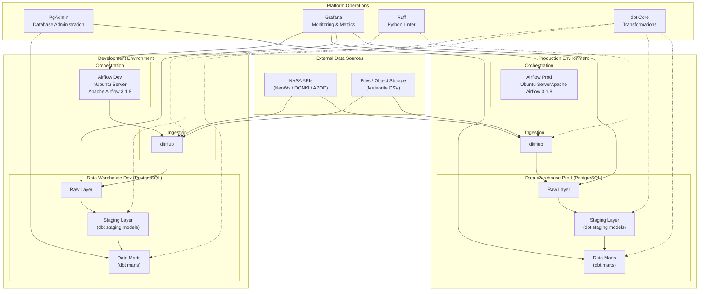

# nasa-analysis

An end-to-end data engineering project that collects, transforms, and visualizes NASA space data — tracking near-Earth asteroids, solar flare activity, and historical meteorite impacts.

## The Modern Data Stack

This project leverages the **Modern Data Stack (MDS)** approach, emphasizing modular, best-in-class tools that are developer-friendly and code-first.

### 🚀 **Apache Airflow** (Orchestration)
The command center of our data platform. Airflow allows us to author, schedule, and monitor workflows as code.
- **Why we use it:** To orchestrate the sequence of ingestion, validation, and transformation tasks reliably.

### 📥 **dlt (dlthub)** (Ingestion)
A Python library for data loading. `dlt` (Data Load Tool) automates the extraction and loading (EL) process, handling complex API responses and schema evolution automatically.
- **Why we use it:** To streamline loading nested JSON data from NASA APIs into PostgreSQL without manually maintaining schemas.

### 🛠️ **dbt** (Transformation)
The transformation layer (the "T" in ELT). `dbt` (data build tool) allows us to transform data in the warehouse using SQL.
- **Why we use it:** To clean, test, and model raw data into analytics-ready tables using modular SQL files and built-in version control.

## Architecture



## Data Sources

| Source | API / File | Description |
|---|---|---|
| NeoWs | NASA NeoWs REST API | Near-Earth asteroid close-approach data |
| DONKI | NASA DONKI REST API | Solar flare and space weather events |
| APOD | NASA APOD REST API | Astronomy Picture of the Day metadata |
| Meteorite Landings | CSV (NASA Open Data) | Historical meteorite impact records |

## Tech Stack

| Layer | Tool | Version |
|---|---|---|
| Orchestration | Apache Airflow (CeleryExecutor) | 3.1.8 |
| Ingestion | dltHub | 1.23 |
| Message Broker | Redis | 7.2 |
| Data Warehouse | PostgreSQL | 17 |
| Transformations | dbt Core | — |
| Code Quality | Ruff | — |
| DB Administration | PgAdmin | — |
| Monitoring | Grafana | — |
| Container Runtime | Docker Compose | — |
| Language | Python | ≥ 3.13 |

## Project Structure

```
nasa-analysis/
├── config/               # Airflow configuration files
├── dags/                 # Airflow DAG definitions
├── logs/                 # Airflow task logs (gitignored)
├── plugins/              # Custom Airflow plugins
├── utils/
│   └── build.sh          # Environment-aware startup script
├── docker-compose.yaml   # All services definition
├── pyproject.toml
└── requirements.txt
```

## Prerequisites

- Docker and Docker Compose
- Git
- A [NASA API key](https://api.nasa.gov/) (free)

## Environment Setup

The project uses branch-based environment files:

| Git Branch | Env File |
|---|---|
| `dev` | `.env.dev` |
| `main` | `.env.prod` |

Create the appropriate env file by copying the example and filling in the required values:

```bash
cp .env.example .env.dev   # for development
```

Required variables:

```dotenv
# Airflow database
AIRFLOW__DATABASE__SQL_ALCHEMY_CONN=
AIRFLOW__CELERY__RESULT_BACKEND=
AIRFLOW__CORE__FERNET_KEY=

# PostgreSQL
POSTGRES_USER=
POSTGRES_PASSWORD=
POSTGRES_DB=

# Airflow admin user
_AIRFLOW_WWW_USER_USERNAME=
_AIRFLOW_WWW_USER_PASSWORD=

# NASA API
NASA_API_KEY=

# Optional
LOAD_EXAMPLES=false
AIRFLOW_UID=   # run: echo $(id -u)
```

## Getting Started

1. **Clone the repository**

   ```bash
   git clone <repo-url>
   cd nasa-analysis
   ```

2. **Check out the desired branch**

   ```bash
   git checkout dev      # development
   # or
   git checkout main     # production
   ```

3. **Create and populate the env file** (see [Environment Setup](#environment-setup) above).

4. **Start all services**

   ```bash
   bash utils/build.sh
   ```

   The script automatically selects the correct env file for the current branch, tears down any running stack, and starts all services.

   Optional flags:

   ```bash
   bash utils/build.sh --volumes    # also remove persistent volumes
   bash utils/build.sh --networks   # also prune project networks
   ```

5. **Access the Airflow UI** at [http://localhost:8080](http://localhost:8080)

## Services & Ports

| Service | Port | Notes |
|---|---|---|
| Airflow API Server / UI | `8080` | Main Airflow interface |
| Celery Flower | `5555` | Start with `--profile flower` |

## Data Pipeline

Data flows through three layers in PostgreSQL:

1. **Raw** — dltHub loads API responses and CSV data as-is.
2. **Staging** — dbt models clean, cast, and rename raw records.
3. **Data Marts** — dbt models produce analytics-ready tables for reporting.

Airflow DAGs schedule and coordinate each ingestion and transformation step.

## Development

Run the linter:

```bash
ruff check .
ruff format .
```

Trigger dbt transformations manually:

```bash
dbt run
dbt test
```
