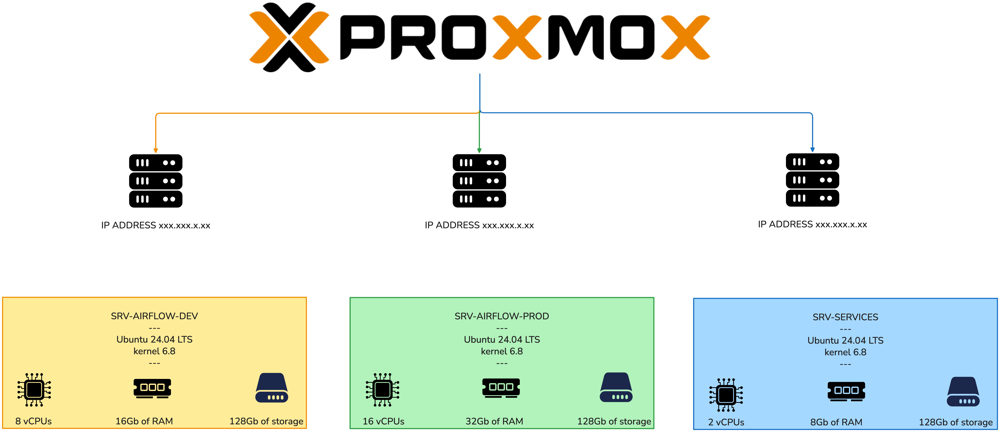

<h1 align="center"><b>NASA ANALYSIS</b></h1>

<div align="center">
  
</div>

<div align="center">

        

> **An end-to-end data engineering project that collects, transforms, and visualizes NASA space data — tracking near-Earth asteroids, solar flare activity, and historical meteorite impacts.**
>
> **Deployed on a self-hosted infrastructure running on Proxmox.**

**English** | 🌐 [Français](README.fr.md)

</div>

---

## 📋 Table of Contents

1. [Why This Project Exists](#-why-this-project-exists)
2. [The Modern Data Stack](#-the-modern-data-stack)
3. [Architecture](#-architecture)
   - [Environments](#-environments)
   - [Infrastructure](#%EF%B8%8F-infrastructure)
   - [Data Pipeline Flow](#-data-pipeline-flow)
   - [ELT Pattern & Medallion Architecture](#%EF%B8%8F-elt-pattern--medallion-architecture)
   - [DAG Pattern](#-dag-pattern)
   - [Engineering Rationale](#-engineering-rationale--why-each-decision-was-made)
4. [ELT in Practice — End-to-End Walkthrough](#-elt-in-practice--end-to-end-walkthrough)
5. [Data Sources](#-data-sources)
6. [Tech Stack](#-tech-stack)
7. [Project Structure](#-project-structure)
8. [dbt — Transformations](#%EF%B8%8F-dbt--transformations)
9. [Snowflake Setup](#%EF%B8%8F-snowflake-setup)
10. [Data Visualization (Metabase)](#-data-visualization-metabase)
11. [Monitoring & Alerting (Grafana)](#-monitoring--alerting-grafana)
12. [CI/CD Pipeline](#%EF%B8%8F-cicd-pipeline)
13. [Getting Started](#-getting-started)
14. [Development](#-development)

---

## 🎯 Why This Project Exists

This project was built as a **personal data engineering portfolio** — an end-to-end modern data platform built on real NASA public APIs and datasets, not toy examples or pre-cleaned CSVs.

The goal was deliberate: design, build, and operate a **production-grade pipeline** from scratch — complete with real orchestration, automatic schema evolution, data quality contracts, CI/CD, and a layered transformation model — all running on self-hosted infrastructure managed by a single engineer.

Every architectural decision reflects how a data engineering team would approach this problem in a real company. The entire stack embodies the **Minimalist's Data Stack** philosophy described in [*The Minimalist's Data Stack*](https://perspectives.datainstitute.io/the-minimalists-data-stack-19b0a0aeef3e) by the Data Institute: a single engineer can build and maintain a **complete, production-quality data platform** with a small set of composable, best-in-class tools — without a large team or a cloud budget.

---

## 🛠 The Modern Data Stack

This project leverages the **Modern Data Stack (MDS)** approach, emphasizing modular, best-in-class tools that are developer-friendly and code-first.

* **🚀 Apache Airflow (Orchestration)**  
  The command center of our data platform. Airflow allows us to author, schedule, and monitor workflows as code.
  > **Why we use it:** To orchestrate the sequence of ingestion, validation, and transformation tasks reliably.

* **📥 dlt | dlthub (Ingestion)**  
  A Python library for data loading. `dlt` (Data Load Tool) automates the extraction and loading (EL) process, handling complex API responses and schema evolution automatically.
  > **Why we use it:** To streamline loading nested JSON data from NASA APIs into Snowflake without manually maintaining schemas.

* **🏛️ dbt (Transformation)**  
  The transformation layer (the "T" in ELT). `dbt` (data build tool) allows us to transform data in the warehouse using SQL.
  > **Why we use it:** To clean, test, and model raw data into analytics-ready tables using modular SQL files and built-in version control.

* **📊 Apache Metabase (Visualization)**  
  An open-source business intelligence tool that connects directly to Snowflake Gold mart tables.
  > **Why we use it:** To build interactive dashboards and charts on top of the analytics-ready mart models, without writing any front-end code.

---

## 📐 Architecture

<div align="center">
  
</div>

> **What this diagram shows:** The full ELT pipeline — NASA data sources (REST APIs and CSV) are extracted and loaded by `dlt` into raw Snowflake schemas, then transformed through dbt's three-layer Medallion model (Bronze → Silver → Gold). Apache Airflow orchestrates every stage end-to-end.

### Architecture Overview
This project implements a **containerized data pipeline** orchestrated with Apache Airflow, supporting both development and production environments with identical structures and isolated infrastructure.

#### 🌍 Environments
The system is split into two parallel environments, each running on dedicated Ubuntu-based servers (self-hosted on **Proxmox**) and utilizing Docker to ensure consistency, portability, and reproducibility:
* **Development:**  `srv-airflow-dev`
* **Production:** `srv-airflow-prod`

#### 🖥️ Infrastructure

<div align="center">
  
</div>

> **What this diagram shows:** The self-hosted Proxmox infrastructure — three Ubuntu-based VMs provide fully isolated environments for development (`srv-airflow-dev`), production (`srv-airflow-prod`), and dedicated server monitoring (`srv-services`). Each Airflow VM is self-contained: it runs the full Airflow stack plus its own PostgreSQL container for Airflow metadata, all behind an NGINX reverse proxy for HTTPS termination. `srv-services` hosts **Grafana** (`12.4.1`) which monitors infrastructure metrics (CPU, memory, disk, network) across all three VMs and tracks Airflow DAG processing health — it has no connection to the Snowflake data warehouse.

Three VMs are provisioned on Proxmox. `srv-airflow-dev` and `srv-airflow-prod` are each **self-contained**: they run the full Airflow stack (scheduler, workers, webserver, Redis) alongside a dedicated **PostgreSQL container** for Airflow metadata — all managed by Docker Compose, all as a **non-root user** behind an **NGINX reverse proxy** for HTTPS termination. The data warehouse is Snowflake (cloud-hosted), so no shared database VM is needed. `srv-services` is dedicated exclusively to **server monitoring and alerting** — it runs Grafana to track infrastructure metrics (CPU, memory, disk, network) across all VMs and monitor DAG processing health, routing alerts to Slack. It has no role in the data pipeline and no connection to Snowflake.

#### 🔄 Data Pipeline Flow
1. **Data Sources:** Primary integrations are NASA APIs, with additional internal/third-party files.
2. **Data Ingestion:** API data is extracted and normalized using `dlthub` within Airflow DAGs.
3. **Data Storage (Raw Layer):** Loads directly into Snowflake (database: `dw_nasa_dev`, schema: `nasa_neows`).
4. **Data Transformation & Testing:** `dbt` models structure the data into refined sets for analytics, enforcing **data quality tests** (uniqueness, non-null, referential integrity).
5. **Orchestration:** Managed end-to-end by Airflow.

#### 🏛️ ELT Pattern & Medallion Architecture

**Why ELT, not ETL**

This project implements the **ELT** (Extract → Load → Transform) pattern. Raw data is extracted from NASA APIs and loaded directly into Snowflake first — no transformation happens outside the warehouse. Only once data is safely persisted does `dbt` apply business logic in-warehouse.

Three key advantages over ETL:
- **Full audit trail** — raw source data is always preserved in Snowflake; if transformation logic changes, historical data can be re-transformed without re-calling the API
- **Flexibility** — new metrics and derived columns can be added retroactively on already-ingested data
- **Separation of concerns** — `dlt` owns Extract + Load; `dbt` owns all Transforms in version-controlled, tested SQL

**The Medallion Architecture**

The `dbt` transformation layer follows the **Medallion Architecture**, organizing models into three progressive layers of increasing data quality and business meaning:

| Layer | Prefix | Folder | Materialization | Responsibility |
| :--- | :--- | :--- | :--- | :--- |
| **🟤 Bronze** | `base_*` | `models/staging/` | View | Raw 1:1 snapshot of the source table. All columns preserved, no filtering, no business logic. The immutable origin referenced by all Silver models. |
| **⚪ Silver** | `stg__*` | `models/staging/` | View | Cleaned, typed, renamed columns. Selects meaningful fields, casts types, renames to business-friendly names. Every Silver model references its Bronze counterpart via `ref()`. |
| **🟡 Gold** | `mart__*` | `models/marts/` | Table | Analytics-ready models enriched with derived columns, aggregations, date parts, and business categorisations. The final layer available for consumption by any downstream BI or reporting tool. |

Placing Bronze and Silver in the same `staging/` folder is intentional: both live at the source-facing end of the pipeline, but responsibilities are cleanly delineated by prefix (`base_*` vs `stg__*`).

#### 🔁 DAG Pattern

All DAGs share the same standard task structure:

<div align="center">
  
</div>

> **What this diagram shows:** The standard branching DAG pattern shared by all four pipelines. The `HttpSensor` (`is_api_available`) polls the NASA API; the `BranchPythonOperator` (`check_availability`) routes execution to `extract_and_load` when data is available, or `stop` when the API is unavailable or rate-limited — ensuring every run completes cleanly without spurious failures.

1. **`is_api_available`** *(sensor)* — polls the data source every 30 seconds. Returns the raw response on success, `None` on rate-limit (HTTP 429), or keeps poking on any other failure.
2. **`check_availability`** *(branch)* — routes execution: proceeds to `extract_and_load` if data was returned, or diverts to `stop` if the source was unavailable/rate-limited.
3. **`extract_and_load`** — runs the `dlt` pipeline to extract, normalize, and load data into Snowflake.
4. **`stop`** — graceful no-op branch that marks the run as skipped without raising an error.

The average time execution of each DAG takes less than 30 seconds.

#### 🧠 Engineering Rationale — Why Each Decision Was Made

| Tool | Rationale |
| :--- | :--- |
| **Apache Airflow** | Industry-standard orchestrator with DAG-as-code (Python), a full web UI, retry logic, SLA monitoring, and horizontal scaling via CeleryExecutor. The custom `HttpSensor → BranchPythonOperator` pattern gives every DAG idempotency and graceful degradation when APIs are unavailable or rate-limited. |
| **dlt** | Zero-boilerplate ingestion with automatic schema inference and evolution — when NASA changes an API response shape, `dlt` adapts without manual intervention. Native handling of deeply nested JSON (e.g. NeoWs diameter data across multiple unit keys) eliminates hundreds of lines of brittle ETL code. |
| **Snowflake** | Separation of storage and compute means raw data sits at near-zero cost, with compute only scaled up during transformation runs. The free tier handles all project workloads comfortably. SQL-native transformations in dbt run directly inside Snowflake without any external compute. |
| **dbt** | SQL-first transformation with version control, a built-in lineage graph, data quality contracts (YAML tests), and auto-generated documentation — all in one tool. The `ref()` function builds execution order automatically, eliminating manual dependency scripts. |
| **Docker Compose** | Dev/prod parity: the same `docker-compose.yaml` runs both environments; only the `.env` file differs. Eliminates "works on my machine" issues — the full production stack can be reproduced locally in seconds. |
| **Proxmox (self-hosted)** | Full infrastructure control at zero ongoing cost. Three VMs mirror a real production topology (two self-contained Airflow instances each with their own embedded PostgreSQL, and a dedicated monitoring VM). Hands-on infrastructure management at a fraction of equivalent cloud VM costs. |
| **Grafana** | Open-source monitoring platform running exclusively on `srv-services`. Tracks server-level infrastructure metrics (CPU, memory, disk, network) for all Proxmox VMs and monitors Airflow DAG processing health. Alerts route to Slack. Grafana has no connection to the Snowflake data warehouse and plays no role in the data pipeline. |

#### ⚙️ CI/CD & Operations
* **CI/CD:** GitHub Actions pipeline with three sequential stages — **Lint → Test → Open PR** — triggered on every push or pull request to `main` and `dev`. See [`.github/workflows/ci-cd.yml`](.github/workflows/ci-cd.yml).
* **Monitoring & Observability:** Server and infrastructure metrics handled by **Grafana** on `srv-services`, with integrated **Slack** alerting. Grafana monitors host-level metrics (CPU, memory, disk) and DAG processing — it is not connected to the data warehouse.
* **Code Quality:** **Ruff** enforces Python linting and formatting across the repository.

---

## 📊 Data Sources

| Source | API / File | Description |
| :--- | :--- | :--- |
| **NeoWs** | NASA NeoWs REST API | Near-Earth asteroid close-approach data |
| **DONKI — GST** | NASA DONKI REST API | Geomagnetic storm event records |
| **DONKI — Solar Flare** | NASA DONKI REST API | Solar flare activity and intensity data |
| **Meteorite Landings** | CSV (NASA Open Data) | Historical meteorite impact records |

---

## 💻 Tech Stack

| Layer | Tool | Version / Spec |
| :--- | :--- | :--- |
| **Orchestration** | Apache Airflow (CeleryExecutor) | `3.1.8` |
| **Ingestion** | dltHub | `1.23` |
| **Data Warehouse** | Snowflake | — |
| **Transformations** | dbt Fusion | `1.0.0.40.15` |
| **Message Broker** | Redis | `7.2` |
| **Code Quality** | Ruff | `0.15.7` |
| **Visualization** | Apache Metabase | — |
| **Infrastructure Monitoring** | Grafana | `12.4.1` |
| **CI/CD** | GitHub Actions | — |
| **Language** | Python | `≥ 3.13` |

---

## 📁 Project Structure

```text
nasa-analysis/                     # Root project directory for NASA data analysis
.
├── .github                        # GitHub configuration
│   ├── instructions               # Copilot instructions
│   └── workflows
│       └── ci-cd.yml              # GitHub Actions CI/CD pipeline
├── .dlt                           # DLT (Data Load Tool) configuration directory               [gitignored]
│   ├── config.toml                # DLT configuration file (pipeline settings)                 [gitignored]
│   └── secrets.toml               # DLT secrets file (credentials, API keys)                   [gitignored]
├── .env.example                   # Example environment variables file
├── .gitignore                     # Specifies files/dirs to ignore in Git
├── .python-version                # Python version specification (for pyenv)
├── README.md                      # Project documentation
├── config                         # Airflow configuration directory
│   ├── airflow.cfg                # Airflow main configuration file
│   └── airflow_local_settings.py  # Custom Airflow settings
├── dags                           # Airflow DAGs directory
│   ├── dlt_pipelines              # Subdirectory for DLT pipeline definitions
│   │   ├── nasa_donki_gst_pipeline.py                # DONKI Geomagnetic Storm pipeline
│   │   ├── nasa_donki_solar_flare_pipeline.py        # DONKI Solar Flare pipeline
│   │   ├── nasa_meteorite_landings_dataset_pipeline.py # Meteorite Landings pipeline
│   │   └── nasa_neows_pipeline.py                    # Near Earth Object Web Service pipeline
│   ├── nasa_donki_gst_dag.py                         # Airflow DAG for DONKI GST data
│   ├── nasa_donki_solar_flare_dag.py                 # Airflow DAG for DONKI Solar Flare data
│   ├── nasa_meteorite_landings_dataset_dag.py        # Airflow DAG for Meteorite Landings data
│   └── nasa_neows_dag.py                             # Airflow DAG for NASA NeoWs data
├── dbt_nasa                       # dbt Fusion project directory
│   ├── dbt_project.yml            # dbt project configuration
│   ├── package-lock.yml           # dbt package lock file
│   ├── packages.yml               # dbt package dependencies
│   ├── macros                     # dbt macro definitions
│   ├── models                     # dbt SQL models
│   │   ├── staging                # Bronze + Silver layers (views)
│   │   │   ├── base_nasa_donki_gst_nasa_donki_gst_response.sql        # 🟤 Bronze
│   │   │   ├── base_nasa_donki_solar_flare_nasa_donki_response.sql    # 🟤 Bronze
│   │   │   ├── base_nasa_meteorite_landings_meteorite_landings.sql    # 🟤 Bronze
│   │   │   ├── base_nasa_neows_nasa_neows_response.sql                # 🟤 Bronze
│   │   │   ├── stg__nasa_donki_gst.sql                                # ⚪ Silver
│   │   │   ├── stg__nasa_donki_solar_flare.sql                        # ⚪ Silver
│   │   │   ├── stg__nasa_meteorite_landings.sql                       # ⚪ Silver
│   │   │   └── stg__nasa_neows.sql                                    # ⚪ Silver
│   │   └── marts                  # Gold layer (tables)
│   │       ├── mart__nasa_donki_gst.sql                               # 🟡 Domain
│   │       ├── mart__nasa_donki_solar_flare.sql                       # 🟡 Domain
│   │       ├── mart__nasa_meteorite_landings.sql                      # 🟡 Domain
│   │       ├── mart__nasa_neows.sql                                   # 🟡 Domain
│   │       ├── mart__nasa_meteorite_by_decade.sql                     # 🟡 Viz
│   │       ├── mart__nasa_neows_hazard_summary.sql                    # 🟡 Viz
│   │       ├── mart__nasa_solar_flare_class_summary.sql               # 🟡 Viz
│   │       └── mart__nasa_space_weather_monthly.sql                   # 🟡 Viz
│   └── dbt_packages               # Installed dbt packages                               [gitignored]
├── docker-compose.yaml            # Docker Compose configuration for services
├── img                            # Image assets directory
│   ├── airflow_dag_example.png            # Example Airflow DAG screenshot
│   ├── nasa_data_engineering_project.png  # Project architecture diagram
│   └── nasa_project_infrastructure.png    # Infrastructure diagram
├── pyproject.toml                 # Python project configuration (build system, tools)
├── logs                           # Logging files
├── requirements.txt               # Python dependencies
├── tests                          # Unit tests (pytest)
│   ├── test_donki_gst_pipeline.py
│   ├── test_donki_solar_flare_pipeline.py
│   ├── test_meteorite_pipeline.py
│   └── test_neows_pipeline.py
├── utils                          # Utility scripts directory
│   ├── build.sh                   # Build automation script
│   └── linting.sh                 # Code linting script
└── uv.lock                        # Lock file for UV package manager (Python)
```

---

## 🏛️ dbt — Transformations

The `dbt_nasa/` project uses **dbt Fusion** and follows a two-layer model structure.

### Model Layers

| Layer | Prefix | Folder | Materialization | Role |
| :--- | :--- | :--- | :--- | :--- |
| **🟤 Bronze** | `base_*` | `models/staging/` | View | Raw 1:1 snapshot of source. All columns, no logic. |
| **⚪ Silver** | `stg__*` | `models/staging/` | View | Cleaned, typed, renamed. References Bronze via `ref()`. |
| **🟡 Gold** | `mart__*` | `models/marts/` | Table | Enriched analytics-ready models. The final layer for downstream consumption. |

#### Core Domain Marts

| Model | Description |
| :--- | :--- |
| `mart__nasa_neows` | Near-Earth asteroids with diameter, magnitude, and hazard attributes |
| `mart__nasa_donki_gst` | Geomagnetic storm events enriched with `event_year`, `event_month`, `event_day_of_week` |
| `mart__nasa_donki_solar_flare` | Solar flare events with derived NOAA `class_category` and date columns |
| `mart__nasa_meteorite_landings` | Meteorite impacts with typed coordinates, `landing_year`, and bucketed `mass_category` |

#### Visualization Marts

Built on top of the domain marts to power downstream consumption of aggregated space-weather and astronomy data:

| Model | Dashboard Use Case |
| :--- | :--- |
| `mart__nasa_neows_hazard_summary` | Asteroid count and diameter stats split by hazard flag — stat panels and pie charts |
| `mart__nasa_solar_flare_class_summary` | Monthly flare count by NOAA class — time-series intensity chart |
| `mart__nasa_space_weather_monthly` | GST and flare counts combined per month — cross-dataset trend dashboard |
| `mart__nasa_meteorite_by_decade` | Landing count and mass aggregated by decade — historical timeline chart |

### Key Commands

```bash
cd dbt_nasa

# Install / update dependencies
dbt deps

# Run all models
dbt run

# Run a single model
dbt run --select stg__nasa_neows

# Run an entire layer
dbt run --select staging
dbt run --select marts

# Execute data quality tests
dbt test

# Test a single model
dbt test --select mart__nasa_donki_gst

# Build (run + test) — recommended for CI
dbt build

# Build only models that changed since the last run
dbt build --select state:modified+

# Preview compiled SQL without executing
dbt compile

# Generate and serve documentation
dbt docs generate
dbt docs serve          # opens http://localhost:8080

# Clean compiled artefacts
dbt clean
```

### Configuration

| File | Purpose |
| :--- | :--- |
| `dbt_project.yml` | Project name, profile, model paths, and materialization defaults |
| `packages.yml` | Declares `dbt_utils ≥ 1.3.0` as a dependency |
| `package-lock.yml` | Locks the resolved package versions |
| `models/staging/_src__*.yml` | Source definitions (schema, freshness checks) |
| `models/staging/_stg__*.yml` | Staging model contracts and column tests |
| `models/marts/_mart__*.yml` | Mart model contracts and column tests |

### Connection Profile

dbt connects to Snowflake via the `dbt_nasa` profile declared in `~/.dbt/profiles.yml`. Make sure your Snowflake credentials (account, user, password, database, warehouse, role) are configured in the profile before running any dbt command.

---

## 🔍 ELT in Practice — End-to-End Walkthrough

This section traces a single run of the **DONKI Solar Flare pipeline** from raw API call to a queryable Metabase chart — the same pattern applies to all four pipelines.

### Step 1 — Airflow triggers the DAG

Every day at midnight UTC, Airflow schedules `nasa_donki_solar_flare_dlt_pipeline_airflow_dag`. The DAG covers a sliding 7-day window (`start_date = today - 7`, `end_date = today`).

### Step 2 — `is_api_available` (HttpSensor)

The sensor pings the NASA DONKI `/FLR` endpoint with the configured date range and API key. It retries every 30 seconds:
- **HTTP 200** with data → returns the raw response, moves to `check_availability`
- **HTTP 429** (rate-limited) → returns `None`, moves to `check_availability`
- **Any other failure** → keeps poking (Airflow handles retries)

### Step 3 — `check_availability` (BranchPythonOperator)

Inspects the sensor output:
- Data returned → routes to `extract_and_load`
- `None` (rate-limited or empty) → routes to `stop` (skipped cleanly, no alert)

### Step 4 — `extract_and_load` (dlt)

`dlt` calls the DONKI `/FLR` API and receives a JSON array of solar flare objects:

```json
[
  {
    "flrID": "2024-03-15T01:00:00-FLR-001",
    "beginTime": "2024-03-15T01:00Z",
    "peakTime": "2024-03-15T01:23Z",
    "endTime": "2024-03-15T01:45Z",
    "classType": "M1.5",
    "sourceLocation": "N12W34",
    "activeRegionNum": 13590
  }
]
```

`dlt` automatically:
- **Infers the schema** from the JSON keys
- **Normalises** the nested structure into flat columns (snake_case: `flrID` → `flr_id`)
- **Merges** with the existing table using `flrID` as the primary key — no duplicates on re-runs
- **Loads** into Snowflake: `dw_nasa_dev.nasa_donki_solar_flare.nasa_donki_response`

If NASA adds a new field to the API response, `dlt` detects the schema change and adds the column automatically on the next run — no manual migration required.

### Step 5 — dbt Bronze (base model)

`base_nasa_donki_solar_flare_nasa_donki_response` is a **view** that preserves the full raw table:

```sql
-- Snowflake: dw_nasa_dev.dbt_nasa.base_nasa_donki_solar_flare_nasa_donki_response
with source as (
    select * from dw_nasa_dev.nasa_donki_solar_flare.nasa_donki_response
),
renamed as (
    select
        flr_id, begin_time, peak_time, end_time,
        class_type, source_location, active_region_num,
        _dlt_load_id, _dlt_id
    from source
)
select * from renamed
```

This is the **immutable layer** — if a transformation bug is found at Silver or Gold, nothing here needs to change.

### Step 6 — dbt Silver (staging model)

`stg__nasa_donki_solar_flare` is a **view** that references the Bronze model and applies light cleaning:

```sql
-- Snowflake: dw_nasa_dev.dbt_nasa.stg__nasa_donki_solar_flare
SELECT
    flr_id,
    begin_time,
    peak_time,
    end_time,
    class_type,
    source_location
FROM {{ ref('base_nasa_donki_solar_flare_nasa_donki_response') }}
```

Only business-relevant columns are exposed. `_dlt_*` metadata columns are dropped. Types are already correct (Snowflake infers `TIMESTAMP` from ISO 8601 strings via dlt).

### Step 7 — dbt Gold (mart model)

`mart__nasa_donki_solar_flare` is a **table** (materialised, not a view) that enriches Silver with derived analytics columns:

```sql
-- Snowflake: dw_nasa_dev.dbt_nasa.mart__nasa_donki_solar_flare
SELECT
    flr_id,
    begin_time,
    class_type,
    LEFT(class_type, 1)           AS class_category,   -- 'M1.5' → 'M'
    DATE(begin_time)              AS event_date,
    EXTRACT(YEAR FROM begin_time) AS event_year,
    EXTRACT(MONTH FROM begin_time) AS event_month,
    DAYOFWEEK(begin_time)         AS event_day_of_week
FROM {{ ref('stg__nasa_donki_solar_flare') }}
```

`class_category` is derived from `class_type` by extracting the first character — turning `M1.5` into `M`, `X2.3` into `X`, enabling grouping and filtering by NOAA intensity class.

dbt also runs **data quality tests** automatically after materialising this model:
- `not_null` on `flr_id`, `begin_time`, `class_type`, `class_category`
- `unique` on `flr_id`
- `accepted_values` on `class_category` (must be one of `X`, `M`, `C`, `B`, `A`)

If any test fails, the dbt run exits with a non-zero status and the DAG fails visibly in Airflow.

### Step 8 — Visualization Mart

`mart__nasa_solar_flare_class_summary` pre-aggregates the data for fast dashboard queries:

```sql
-- Snowflake: dw_nasa_dev.dbt_nasa.mart__nasa_solar_flare_class_summary
SELECT
    event_year,
    event_month,
    class_category,
    COUNT(*) AS flare_count
FROM {{ ref('mart__nasa_donki_solar_flare') }}
GROUP BY event_year, event_month, class_category
```

### Step 9 — Metabase Dashboard

Metabase connects directly to Snowflake and queries `mart__nasa_solar_flare_class_summary`. A time-series bar chart grouped by `class_category` and ordered by `event_year + event_month` is rendered with no SQL required — the aggregation is already done in the Gold layer.

**Complete lineage for this pipeline:**
```
NASA DONKI API
  → dlt (Extract + Load)
    → nasa_donki_solar_flare.nasa_donki_response          [raw table]
      → base_nasa_donki_solar_flare_nasa_donki_response   [🟤 Bronze view]
        → stg__nasa_donki_solar_flare                     [⚪ Silver view]
          → mart__nasa_donki_solar_flare                  [🟡 Gold table]
            → mart__nasa_solar_flare_class_summary        [🟡 Viz table]
              → Metabase dashboard
```

---

## � Data Visualization (Metabase)

<div align="center">
  
</div>

> **What this dashboard shows:** The `nasa-dashboard` in Metabase, connected directly to the Gold mart tables in Snowflake. Five panels visualize the meteorite landings dataset: a world map of every recorded impact location color-coded by region density, a combo chart of meteorite count vs. average mass broken down by mass category, a bubble scatter plot of the largest meteorites plotted by geographic coordinates (bubble size = mass), a ranked table of the 10 most common meteorite classification types, and a reference table of the 20 heaviest meteorites ever found with their mass, landing year, and coordinates.

Apache Metabase connects directly to the **Gold mart tables** (`mart__*`) in the `dbt_nasa` Snowflake schema — it never queries raw or staging layers. No SQL is required in the BI layer: all aggregations and derived columns are already computed upstream by `dbt`, so every panel is built using Metabase's point-and-click interface.

### Dashboard Panels

| Panel | Source Model | Description |
| :--- | :--- | :--- |
| **meteorites_by_country_region** | `mart__nasa_meteorite_landings` | World map plotting every meteorite landing by latitude/longitude, color-coded by region density |
| **Average mass per occurrence** | `mart__nasa_meteorite_landings` | Combo chart: meteorite count (line) and average mass in grams (bar) broken down by `mass_category` (small → very_large) |
| **largest_meteorites_ever_found** | `mart__nasa_meteorite_landings` | Bubble scatter plot of the heaviest meteorites by geographic coordinates — bubble size represents mass |
| **top10_most_common_recclass** | `mart__nasa_meteorite_landings` | Ranked table of the 10 most frequent meteorite reclassification types (e.g. L6: 8,279 · H5: 7,138) |
| **top20_largest_meteorite_found** | `mart__nasa_meteorite_landings` | Reference table of the 20 heaviest meteorites with name, mass in grams, landing year, latitude, and longitude |

---

## �📈 Monitoring & Alerting (Grafana)

<div align="center">
  
</div>

Server and infrastructure monitoring is handled by **Grafana `12.4.1`** running exclusively on `srv-services`. It has **no role in the data pipeline** and **no connection to Snowflake** — its sole purpose is to track the health of the infrastructure and alert when something goes wrong.

### What Is Monitored

| Category | Metrics | Source |
| :--- | :--- | :--- |
| **CPU** | Usage %, load average per core | Node Exporter (all 3 VMs) |
| **Memory** | RAM used/available, swap | Node Exporter (all 3 VMs) |
| **Disk** | I/O read/write, space used/free | Node Exporter (all 3 VMs) |
| **Network** | Bytes in/out, dropped packets | Node Exporter (all 3 VMs) |
| **DAG Processing** | DAG import errors, parser duration | Airflow StatsD metrics |

### Alert Routing

Alerts are configured in Grafana and routed directly to **Slack** via a webhook. Notifications are triggered on:
- Any VM CPU sustained above threshold
- Memory pressure nearing capacity
- Disk space below a safe threshold
- DAG import errors detected in the Airflow processor

### Architecture

All three VMs expose their system metrics via **Prometheus Node Exporter**. Grafana on `srv-services` scrapes these endpoints and renders them in a unified dashboard. This is a one-way pull model — `srv-services` reaches out to the other VMs; they do not push to it.

```
srv-airflow-dev  ──[Node Exporter:9100]──┐
srv-airflow-prod ──[Node Exporter:9100]──┤──► Prometheus ──► Grafana (srv-services)
srv-services     ──[Node Exporter:9100]──┘                        │
                                                               Slack alerts
```

### Separation from the Data Stack

Grafana intentionally operates in a separate lane from the ELT pipeline:

| What Grafana does | What Grafana does NOT do |
| :--- | :--- |
| Monitor VM CPU / memory / disk / network | Query Snowflake or dbt models |
| Alert on DAG processing errors | Visualize NASA data metrics |
| Track Airflow scheduler health | Connect to any data warehouse |

Data visualization (charts, dashboards on NASA science data) is handled by **Apache Metabase**, which connects directly to the Gold mart tables in Snowflake. Grafana and Metabase are entirely separate tools with non-overlapping responsibilities.

---

## ⚙️ CI/CD Pipeline

The project uses **GitHub Actions** ([`.github/workflows/ci-cd.yml`](.github/workflows/ci-cd.yml)) with three sequential jobs triggered on every push or pull request to `main` and `dev`:

| Step | Job | What it does |
| :---: | :--- | :--- |
| 1 | **Lint** | Runs `ruff check` and `ruff format --check` on the `dags/` directory. Fails fast on any style or lint error. |
| 2 | **Test** | Runs `pytest tests/ -v`. Only executes if lint passes. |
| 3 | **Open PR** | Auto-creates a pull request from `dev` → `main`. Only runs on direct pushes to `dev` (not PRs). Uses the built-in `GITHUB_TOKEN` — no custom secrets required. |

---

## 🚦 Getting Started

### 1. Prerequisites
* **Docker** and **Docker Compose**
* **Git**
* A [NASA API key](https://api.nasa.gov/) *(free)*

### 2. Environment Setup
The project uses branch-based environment files:
* `dev` branch uses `.env.dev`
* `main` branch uses `.env.prod`

Create the appropriate env file by copying the example and filling in the required values:
```bash
cp .env.example .env.dev 
```

<details>
<summary><b>Click here to see required environment variables</b></summary>
<br>

```dotenv
# Airflow authentication
AIRFLOW__API_AUTH__JWT_SECRET=
AIRFLOW__API_AUTH__JWT_ISSUER=

# Airflow database
AIRFLOW__DATABASE__SQL_ALCHEMY_CONN=
AIRFLOW__CELERY__RESULT_BACKEND=

# PostgreSQL
POSTGRES_USER=
POSTGRES_PASSWORD=
POSTGRES_DB=

# Airflow admin user
_AIRFLOW_WWW_USER_USERNAME=
_AIRFLOW_WWW_USER_PASSWORD=

# NASA API
AIRFLOW_VAR_NASA_API_KEY=

# Optional
LOAD_EXAMPLES=false
AIRFLOW_UID=   # run: echo $(id -u)
```
</details>

### 3. Launching the Platform

Clone the repository and select your branch:
```bash
git clone <repo-url>
cd nasa-analysis
git checkout dev  # or 'main'
```

Start all services utilizing the build script:
```bash
bash utils/build.sh 
bash utils/build.sh --volumes # remove all volumes and create new one
bash utils/build.sh --networks # remove all networks and create new one
bash utils/build.sh --volumes --networks # remove all volumes and network and create new one
```
*(The script automatically selects the correct env file, tears down any running stack, and brings up the services.)*

**Access the Airflow UI:** [http://localhost:8080](http://localhost:8080)

---

## 🔧 Development

**Run the linter and formatter:**
```bash
ruff check .
ruff format .
```

**Run the unit tests:**
```bash
uv run pytest tests/ -v
```

**Trigger dbt transformations manually:**
```bash
cd dbt_nasa

dbt deps                  # install dbt packages (dbt_utils, etc.)
dbt run                   # build all models (staging views + mart tables)
dbt test                  # run all data quality tests
dbt build                 # run + test in a single command (recommended)
```

---

## ❄️ Snowflake Setup

All data lands in a single Snowflake database (`dw_nasa_dev`). `dlt` manages the raw ingestion schemas; `dbt` manages the transformation schema.

### Schema Layout

```
dw_nasa_dev
├── nasa_donki_gst            ← dlt raw schema (GST events)
│   └── nasa_donki_gst_response
├── nasa_donki_solar_flare    ← dlt raw schema (solar flares)
│   └── nasa_donki_response
├── nasa_meteorite_landings   ← dlt raw schema (meteorite landings)
│   └── meteorite_landings
├── nasa_neows                ← dlt raw schema (near-Earth objects)
│   └── nasa_neows_response
└── dbt_nasa                  ← dbt transformation schema
    ├── base_*                   (Bronze views)
    ├── stg__*                   (Silver views)
    └── mart__*                  (Gold tables)
```

### Credentials & Roles

A dedicated service account `loader` with a custom role `DLT_LOADER_ROLE` is used for all pipeline operations (`dlt` ingestion and `dbt` transformations). This follows the principle of least privilege — the role has no access to other databases.

### Setup SQL

Run the following script once in Snowflake to provision the database, user, role, and warehouse permissions before running any pipeline:

```sql
-- Create the target database
CREATE DATABASE IF NOT EXISTS dw_nasa_dev;

-- Create a dedicated service account for the pipeline
CREATE USER IF NOT EXISTS loader
    PASSWORD = '<your_password>'
    DEFAULT_ROLE = DLT_LOADER_ROLE
    DEFAULT_WAREHOUSE = COMPUTE_WH;

-- Create a scoped role for all pipeline operations
CREATE ROLE IF NOT EXISTS DLT_LOADER_ROLE;
GRANT ROLE DLT_LOADER_ROLE TO USER loader;

-- Grant database-level access
GRANT USAGE ON DATABASE dw_nasa_dev TO ROLE DLT_LOADER_ROLE;

-- Allow dlt to create new raw schemas automatically
GRANT CREATE SCHEMA ON DATABASE dw_nasa_dev TO ROLE DLT_LOADER_ROLE;

-- Allow compute warehouse usage
GRANT USAGE ON WAREHOUSE COMPUTE_WH TO ROLE DLT_LOADER_ROLE;

-- Propagate access to all schemas and tables created in future
GRANT ALL PRIVILEGES ON FUTURE SCHEMAS IN DATABASE dw_nasa_dev TO ROLE DLT_LOADER_ROLE;
GRANT ALL PRIVILEGES ON FUTURE TABLES IN DATABASE dw_nasa_dev TO ROLE DLT_LOADER_ROLE;
```

### dbt Connection Profile

Configure `dbt_nasa/profiles.yml` (or `~/.dbt/profiles.yml`) with the `loader` credentials:

```yaml
dbt_nasa:
  target: dev
  outputs:
    dev:
      type: snowflake
      account: "<account_identifier>"   # e.g. xy12345.eu-west-1
      user: loader
      password: "<your_password>"
      role: DLT_LOADER_ROLE
      database: dw_nasa_dev
      warehouse: COMPUTE_WH
      schema: dbt_nasa
      threads: 4
```

### dlt Secrets

Configure `.dlt/secrets.toml` with the same credentials so `dlt` can load into the raw schemas:

```toml
[destination.snowflake.credentials]
account = "<account_identifier>"
user = "loader"
password = "<your_password>"
database = "dw_nasa_dev"
warehouse = "COMPUTE_WH"
role = "DLT_LOADER_ROLE"
```